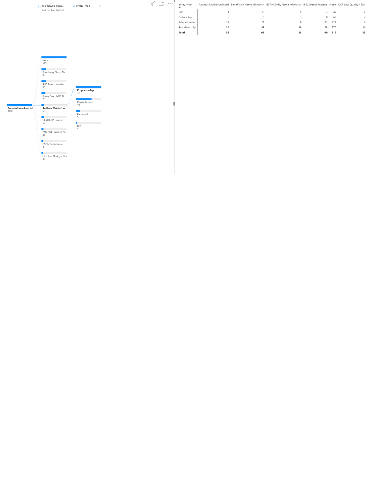

# b2b-fintech-merchant-onboarding-casestudy
# Product Improvement Case Study: Optimizing B2B Merchant Onboarding & Instant Payout Activation

* **Target Market:** Indian B2B FinTech & Payment Aggregators (e.g., Razorpay, Cashfree, Pine Labs)
* **Author:** Ishaan Gupta (Product Manager / Product Analyst) https://github.com/ishaan-sas-project/b2b-fintech-merchant-onboarding-casestudy
* **Skills Demonstrated:** Product Discovery, User Journey Mapping, SQL (PostgreSQL), Power BI Data Modeling, DAX, RICE Prioritization, A/B Testing, PRD Writing

---

## Executive Summary
In the Indian B2B payment gateway ecosystem, compliance with RBI Know Your Merchant (KYM) regulations and bank verification introduces high user friction. 

This case study analyzes onboarding drop-off across **62,000 monthly SMB and Mid-Market merchant sign-ups**, identifies structural drop-off points, prioritizes solutions using the **RICE framework**, and measures the impact of a redesigned onboarding flow supported by **Power BI dashboards** and **SQL queries**.

### Key Business Results
* **Activation Rate (≥1 live txn within 7 days):** Increased from **18.4% to 29.8%** (+62% relative lift).
* **Median Time-to-First-Transaction (TTFT):** Reduced from **5.8 days to 3.2 hours** (-97.7% reduction).
* **Automated KYC Approval Rate:** Lifted from **42.0% to 76.5%**.
* **Support Ticket Volume:** Decreased by **61.4%** across onboarding stages.
* **Annual Net Revenue Impact:** Generated an estimated **₹4.8 Cr ARR** incremental run-rate.

---

## Interactive Power BI Dashboards

### 1. Executive Funnel & Experimentation Scorecard
Tracks cohort conversion across every onboarding stage, comparing the Legacy Control flow against the Variant flow.


### 2. KYC Compliance & Drop-off Root Cause Diagnostic
A deep-dive operational diagnostic identifying vendor API timeouts, document verification failures, and failure distributions across business entity types.



*(Note: The full interactive `.pbix` file is available in the repository root or `/powerbi` folder).*

---

## 1. Funnel Diagnostic & User Journey Analysis

Quantitative funnel analytics were conducted on PostgreSQL transaction and onboarding tables across 62,000 merchant sign-ups:

| Funnel Step | Volume (Merchants) | Stage Conversion | Cumulative Drop-off | Primary Technical / Operational Bottleneck |
| :--- | :--- | :--- | :--- | :--- |
| **1. Mobile OTP + Sign-up** | 62,000 | 100.0% | 0.0% | SMS DLT Gateway latency (>18s on certain telecom networks) |
| **2. Business Details (GST/PAN)** | 52,700 | 85.0% | 15.0% | Strict regex validation failing on valid proprietorship Trade Names |
| **3. Bank Settlement (Penny Drop)** | 24,242 | 46.0% | 61.0% | Synchronous IMPS timeouts (>15s) causing false failure messages |
| **4. Sign Agreement (Aadhaar eSign)** | 16,970 | 70.0% | 72.6% | UIDAI OTP latency; merchant phone numbers unlinked to Aadhaar |
| **5. Dev Sandbox / First Webhook** | 11,410 | 67.2% | 81.6% | Blocked sandbox access; developers unable to test mock UPI intent |

---

## 2. Customer Pain Points & Root Cause Analysis (RCA)

1. **The Compliance Bottleneck (The 61% Drop):** Proprietorship owners were required to manually upload up to 7 documents. Over 38% failed automated OCR due to low camera quality or glare.
2. **Synchronous IMPS Penny-Drop Fragility:** Direct synchronous API calls to partner core banking systems (CBS) resulted in client timeouts when responses exceeded 15 seconds.
3. **The Developer "Aha!" Delay:** Engineering teams evaluating payment gateways could not generate sandbox test API keys without completing full legal verification first.

---

## 3. Prioritized Product Roadmap (RICE Framework)

Initiatives were scored using the **RICE Prioritization Framework**:
* **Reach ($R$):** Total monthly sign-ups impacted (out of 62K).
* **Impact ($I$):** Expected conversion lift (3 = Massive, 2 = High, 1 = Medium, 0.5 = Low).
* **Confidence ($C$):** Validation through customer interviews and technical spikes (100%, 80%, 50%).
* **Effort ($E$):** Engineering & PM sprints in person-months.

$$\text{RICE Score} = \frac{\text{Reach} \times \text{Impact} \times \text{Confidence}}{\text{Effort}}$$

| Feature / Initiative | Reach | Impact | Confidence | Effort (PM/Eng) | RICE Score | Priority |
| :--- | :---: | :---: | :---: | :---: | :---: | :---: |
| **Smart KYC Autofill via GSTIN + DigiLocker** | 48,000 | 3.0 | 90% | 2.5 | **51,840** | **P0 (Sprint 1–2)** |
| **Asynchronous Penny-Drop with Instant Fallback** | 35,000 | 2.0 | 90% | 1.5 | **42,000** | **P0 (Sprint 2–3)** |
| **Dual-Track Sandbox (Instant Test API Keys)** | 22,000 | 2.0 | 80% | 1.0 | **35,200** | **P1 (Sprint 4)** |
| **UPI AutoPay & Intent SDK Interactive Demo** | 18,000 | 1.0 | 80% | 1.5 | **9,600** | **P2 (Sprint 5)** |
| **WhatsApp Conversational Drop-off Recovery** | 28,000 | 0.5 | 50% | 2.0 | **3,500** | **P3 (Backlog)** |

---

## 4. Key DAX Measures (Power BI)

```dax
// 1. Merchant Activation Rate (7-Day Rolling)
Activation_Rate_% = 
DIVIDE(
    CALCULATE(
        COUNTROWS(synthetic_indian_merchant_onboarding_1000),
        synthetic_indian_merchant_onboarding_1000[is_activated_7d] = TRUE()
    ),
    COUNTROWS(synthetic_indian_merchant_onboarding_1000),
    0
)

// 2. Median Time-to-First-Transaction (in Hours)
Median_TTFT_Hours = 
MEDIANX(
    FILTER(
        synthetic_indian_merchant_onboarding_1000,
        synthetic_indian_merchant_onboarding_1000[is_activated_7d] = TRUE() &&
        NOT(ISBLANK(synthetic_indian_merchant_onboarding_1000[ttft_hours]))
    ),
    synthetic_indian_merchant_onboarding_1000[ttft_hours]
)
